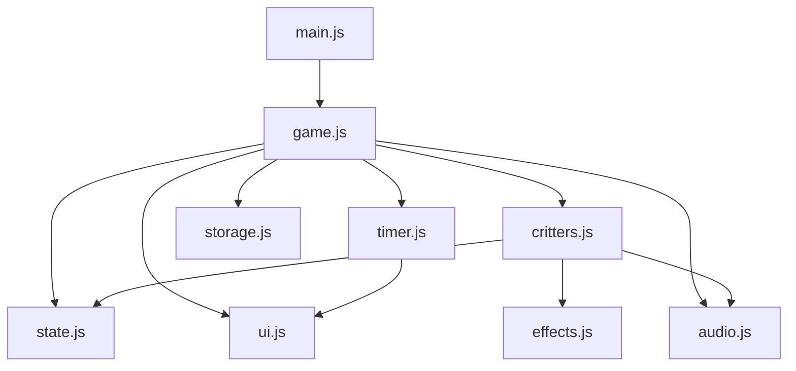

# Critter Bonk — System Architecture

## 1. System Overview

Critter Bonk is structured into three clear tiers:
1. **Python Server & CLI Host** (`main.py` & `game/`): Launches the local environment via standard library `http.server`, serves static web assets, and provides a mirrored headless simulation engine for automated rule validation.
2. **Frontend Game Engine** (`web/`): A client-side vanilla JavaScript architecture (ES Modules pattern) running at 60 FPS using requestAnimationFrame, Web Audio API, and CSS GPU-accelerated transforms.
3. **Quality Engineering & Evaluation Pipeline** (`evaluation/`): Rubric matrices, systematic test checklists, evaluation scorecards, and iterative improvement logs.

---

## 2. Directory Structure & File Roles

```text
CRITTER-BONK/
│
├── main.py                     # Root CLI entry point (python main.py)
├── README.md                   # Complete project manual & run guide
├── requirements.txt            # Dependency specification (Standard Library only)
│
├── game/                       # Python simulation & validation engine
│   ├── __init__.py             # Package exports
│   ├── game.py                 # Game loop orchestrator & verification runner
│   ├── state.py                # Finite State Machine (MENU, PLAYING, PAUSED, GAME_OVER)
│   ├── critters.py             # Critter definitions & attributes
│   ├── scoring.py              # Score-driven difficulty & HPM calculator
│   ├── timer.py                # Drift-compensated clock
│   ├── effects.py              # Visual particle & feedback specifications
│   ├── audio.py                # Synthesizer waveform parameters
│   └── storage.py              # Best score validation & parsing
│
├── web/                        # Browser Game Client
│   ├── index.html              # Twilight Garden UI structure & 3x3 grid
│   │
│   ├── css/
│   │   ├── style.css           # Design tokens, color palette, layered hole 3D effect
│   │   ├── animations.css      # Twinkling stars, emergence physics, shake, confetti
│   │   └── responsive.css      # Mobile, tablet, desktop, touch & high-DPI scaling
│   │
│   ├── js/
│   │   ├── main.js             # Application bootstrapper & DOM attachment
│   │   ├── game.js             # Core gameplay coordinator & loop lifecycle
│   │   ├── state.js            # Frontend state machine & active slot tracker
│   │   ├── critters.js         # Spawning scheduler, emergence animation, hit detection
│   │   ├── effects.js          # Particle bursts, floating +1, screen shake, confetti
│   │   ├── audio.js            # Web Audio API procedural sound synthesizer
│   │   ├── storage.js          # Resilient localStorage best-score persistence
│   │   ├── timer.js            # Drift-free 30s countdown & progress tracker
│   │   └── ui.js               # HUD updates, overlays, modal transitions
│   │
│   └── assets/
│       └── README.md           # Visual & procedural asset documentation
│
├── evaluation/                 # Quality & Evaluation System
│   ├── rubric.md               # 100-Point Quality Rubric
│   ├── test-checklist.md       # Interactive test checklist
│   ├── evaluation-report.md    # Multi-category rubric scorecard
│   └── improvement-log.md      # Multi-iteration development log
│
└── docs/                       # Comprehensive Documentation
    ├── architecture.md         # System structure (this document)
    ├── gameplay-flow.md        # State transitions, user journey, and timings
    └── workflow.md             # Development methodology & theme specs
```

---

## 3. Frontend Architecture

The web client operates with strictly separated responsibilities:



### Module Responsibilities:
* `state.js`: Defines explicit states (`MENU`, `PLAYING`, `PAUSED`, `GAME_OVER`). Forbids illegal state transitions. Holds current score, streak, active holes, and tier.
* `timer.js`: Implements drift compensation using `performance.now()`. Exposes `pause()`, `resume()`, `reset()`, and `onTick(remaining, progress)`.
* `critters.js`: Manages hole occupant states. Ensures immediate emergence on start, enforces single-hit idempotency, and handles despawn timers.
* `audio.js`: Zero external asset dependencies. Procedurally synthesizes retro arcade sounds via `AudioContext` (frequency sweeps, envelopes, gain nodes).
* `effects.js`: Renders localized SVG/Canvas particle bursts, floating gold `+1` indicators, CSS transform screen shake, and celebratory confetti.
* `ui.js`: DOM updater for HUD (Score, Best, Time, Speed Tier Badge, Progress Bar), overlays (Start, Pause, Game Over), and accessibility focus.
* `storage.js`: Wraps `localStorage` in defensive try/catch blocks with numeric sanitization to gracefully handle private browsing modes or malformed values.

---

## 4. Hole Layering & Emergence Mechanics

To strictly fulfill the requirement that critters emerge **from inside the hole** rather than floating above:
1. **Background Interior**: Deep dark burrow with radial gradient (`#140d0a` to `#241812`).
2. **Critter Mask Container**: Positioned inside the hole with `overflow: hidden`.
3. **Critter Sprite**: Translates along the Y-axis from `110%` (hidden beneath the rim) to `10%` (fully emerged).
4. **Foreground Rim Layer**: A layered grassy dirt mound in the foreground (`pointer-events: none`, `z-index: 10`) masking the bottom border of the hole, visually guaranteeing that the critter's body rises out from within the subterranean burrow.
