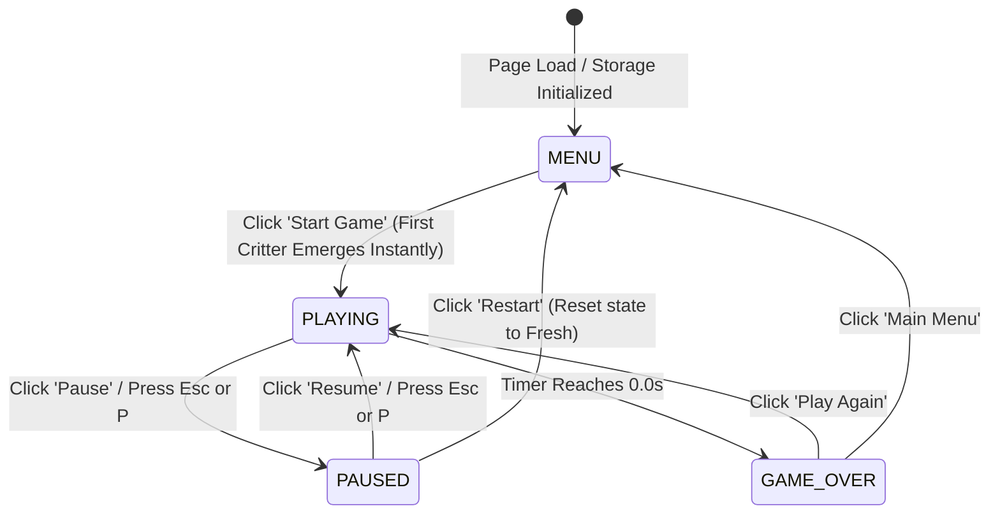

# Critter Bonk — Gameplay Flow & State Lifecycle

## 1. State Machine Lifecycle

Critter Bonk operates as a deterministic finite-state machine (FSM):

---

## 2. Detailed Gameplay Loop & Mechanics

### Phase 1: Boot & Title Screen (MENU)
1. `main.js` bootstraps on `DOMContentLoaded`.
2. `storage.js` retrieves `critter_bonk_best_score` from `localStorage` (default: 0).
3. The background renders the Twilight Garden midnight starfield.
4. AudioContext is suspended until initial user interaction (preventing browser autoplay warnings).
5. Start Screen presents title `🐹 Critter Bonk 🐰`, subtitle, best score preview, sound toggle button, and "Start Bonking!" button.

### Phase 2: Game Launch & Immediate First Spawn
1. Player clicks "Start Bonking!".
2. AudioContext is activated / resumed.
3. State transitions to `PLAYING`.
4. Master 30-second countdown timer initiates.
5. **Critical Requirement Fulfilled**: The first critter spawns **immediately (0ms delay)** into a randomly chosen hole so the player has immediate action without waiting.

### Phase 3: The Active Game Loop
1. **Spawning**:
   - A hole slot is randomly selected from available holes.
   - A critter type is randomly selected from the critter registry:
     - 🐹 Hamster
     - 🐻 Bear
     - 🐸 Frog
     - 🐵 Monkey
     - 🐰 Rabbit
     - 🦊 Fox
   - The critter rises from inside the hole with `critter-rise` CSS keyframe animation.
2. **Player Interaction (Bonk)**:
   - Player taps/clicks or uses keyboard (Enter, Space, or 1–9 numpad).
   - If the hole contains an active, un-bonked critter:
     - **Idempotency Guard**: Slot's `hasBeenHit` flag set to `true` instantly; further clicks on this critter are ignored.
     - Score increments by +1.
     - Total hits increments by +1.
     - **Hit Effects Triggered Simultaneously**:
       - Particle burst radiating from click coordinates.
       - Floating `+1` badge emerges and floats upward.
       - Subtle screen impact shake applied to the arena container.
       - Web Audio synthesizer plays a crisp frequency-swept bonk (with extra vibrance during FRENZY mode).
       - Critter displays bonked reaction (`critter-bonked` squash animation) and retreats into burrow.
     - **Score-Driven Difficulty Recalculation**:
       - Difficulty evaluates current score immediately.
       - If score crosses threshold (5 for FAST, 10 for FRENZY), the HUD badge transforms and subsequent spawn/duration timings accelerate.
3. **Despawn (Miss)**:
   - If timer expires before player hits, critter safely descends into burrow (`critter-retreat`).
   - Respective hole is marked clean.

---

## 3. Score-Driven Difficulty Scaling

Difficulty is governed strictly by **player score**, never by elapsed time:

| Tier | Score Range | Critter Visible Time | Spawn Interval | HUD Badge Color | Audio Pitch |
|---|---|---|---|---|---|
| **EASY** | 0 – 4 points | ~2.50 seconds | 650 – 900 ms | Emerald Green (`#4ade80`) | Normal (320Hz sweep) |
| **FAST** | 5 – 9 points | ~1.60 seconds | 400 – 600 ms | Amber Gold (`#facc15`) | Accelerated (440Hz sweep) |
| **FRENZY** | 10+ points | ~1.00 seconds | 250 – 400 ms | Neon Crimson (`#f87171`) | Hyper (640Hz sweep + saw) |

---

## 4. Pause & Timer Integrity

* When Pause is triggered:
  * Countdown timer halts.
  * Active critter emergence/retreat animations are frozen.
  * Spawning scheduler timer is canceled.
  * Scoring is locked.
* When Resume is clicked:
  * Countdown timer resumes with exact millisecond precision.
  * Spawning scheduler re-engages.
* When Restart is clicked:
  * All timers are cleared and garbage-collected.
  * Holes are cleared.
  * Score and stats reset to 0.
  * Fresh 30-second game begins immediately with no residual or duplicate loops.

---

## 5. Game Over Experience

* When the master 30.0s clock strikes 0:
  * Gameplay instantly terminates; further clicks cannot score.
  * Final statistics calculated:
    * **Final Score**
    * **Total Hits**
    * **Hits Per Minute (HPM)**: $\text{HPM} = \frac{\text{Total Hits}}{30 / 60} = \text{Total Hits} \times 2$
    * **Best Score**
  * If Final Score exceeds previous Best Score:
    * High score updated in `localStorage`.
    * Animated high score badge (`🏆 NEW HIGH SCORE!`) displayed with golden pulse.
    * Confetti shower erupts across the screen.
  * Audio fanfare plays.
  * "Play Again" button initiates a clean, immediate rematch.
